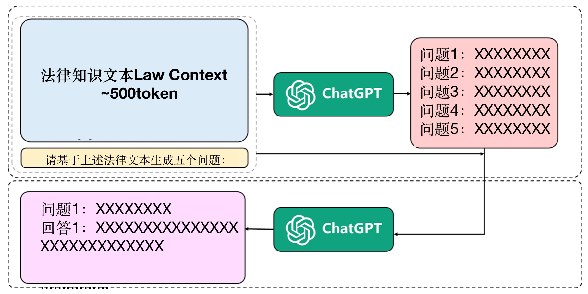

<p align="center">
  
</p>

# LawGPT_zh：中文法律大模型（獬豸）

 


## 项目简介

我们的愿景是为让所有人在遇到法律问题时能第一时间获得专业可靠的回答。因为专业的律师服务只有真正**触手可及**，才会让人们习惯运用，一如二十年前的搜索引擎，十年前的快递业务。我们希望让法律走进日常生活，为构建**法治社会**贡献我们的力量。项目海报由Midjourney生成。

本项目开源的**中文法律通用模型**由ChatGLM-6B LoRA 16-bit指令微调得到。数据集包括现有的法律问答数据集和**基于法条和真实案例指导**的self-Instruct构建的高质量法律文本问答，提高了通用语言大模型**在法律领域的表现**，提高了模型回答的可靠性和专业程度。

## 最近更新
- (2023.5.04): 
1. 回答给出法条依据，使模型回答具有可靠性。
2. 公开训练数据集: 带有法律依据的情景问答92k   利用ChatGPT清洗CrimeKgAssitant数据集得到52k单轮问答

## 快速开始

1. 配置项目依赖环境

   ```bash
   cd src
   pip install -r requirements.txt
   #其中peft需要本地安装
   cd peft
   pip install -e .
   ```

2. [下载](https://pan.baidu.com/s/1FNAoCmvydsE45afqgmIp2A)(提取码：fj9d)ChatGLM-6B模型参数（ChatGLM权重参数有变化，以及函数进行了修改，请下载全部文件），将其放入`./model`目录下。
3. [下载](https://pan.baidu.com/s/1w_Jzh2Vpwq6EgQ-YlVZjag)(提取码：ymor)检索模型参数，将其放入`./retriver`目录下。
4. [下载](https://huggingface.co/shibing624/text2vec-base-chinese)text2vec-base-chinese模型参数，将其放入`./text2vec-base-chinese`目录下。

5. 运行交互文件（要求单卡显存 >= 15G）,输入new chat可以清空上下文信息

   ```bash
   #demo.py为直接生成
   CUDA_VISIBLE_DEVICES=$cuda_id python ./demo.py
   ```

   ```bash
   #demo_r.py加入了检索功能
   CUDA_VISIBLE_DEVICES=$cuda_id python ./demo_r.py
   ```

6. 命令行交互界面实例

   ```tex
   Human:
   信用卡欠账不还后果很严重吗？
   ------------------------------------------------
   Answer:
   信用卡欠款如果不及时偿还，会对自己产生严重的影响。下面是一些可能的后果：
   1.利息和罚款：如果未在规定时间内还款，则会开始收取滞纳金和利息，费用可能会非常高；
   2.信用记录受损：逾期付款会影响个人的信用报告，使个人在未来申请贷款、购房和其他业务时面临困难；
   3.银行起诉：若未能在指定时间内还清全额账单，可能会被银行起诉至法院要求归还债务并支付相应的诉讼费用；
   4.法律风险：逾期付款可能会导致合同违约，构成违约则需要承担违约责任(包括赔偿损失);
   5.失去使用信用卡的权利：如果发现自己的信用记录中存在多次逾期或其他不良记录，将会失去使用某些信用卡或贷款的机会。
   因此，为了避免以上情况的发生，应合理规划好开支，按时按量偿还信用卡欠款。
   ```

## 数据集构建

本项目数据主要分为两个部分：1.律师和用户之间的情景对话 2.对特定法律知识的问答

| 数据类型 |            描述            |   数量   | 占比（%） |
| :------: | :------------------------: | :------: | :-------: |
| 情景对话 | 真实的律师用户问答 |   200k    |   100   |
| 知识问答 |  法律知识问题的解释性回答  |   coming soon   |   0   |
| **总计** |           **-**            | **200k** |  **100**  |

### 情景对话

真实的中文律师用户问答数据，来自[CrimeKgAssitant](https://github.com/liuhuanyong/CrimeKgAssitant)收集的200k条情景对话数据。 

### 利用ChatGPT清洗CrimeKgAssitant数据集得到52k单轮问答  
[下载](https://pan.baidu.com/s/1GZ0IsGQwbiPPy-h04_eTXg)(提取码：MYTT)

利用ChatGPT根据CrimeKgAssitant的问答重新生成，使得生成的回答比原回答更详细，语言组织更规范。
 
### 带有法律依据的情景问答92k  
[下载](https://pan.baidu.com/s/1SaAMvejziZdvDHMh9tPL5Q)(提取码：MYTT)

我们根据[中华人民共和国法律手册](https://github.com/RanKKI/LawRefBook)上最核心的9k法律条文，利用ChatGPT联想生成具体的情景问答，从而使得生成的数据集有具体的法律依据。数据格式如下
```json
"question": "在某家公司中，一名员工对女同事实施了性骚扰行为，女同事向公司进行举报，但公司却没有采取必要的措施来制止这种行为。\n\n公司未采取必要措施预防和制止性骚扰，导致女同事的权益受到侵害，该公司是否需要承担责任？"
"answer": "根据《社会法-妇女权益保障法》第八十条规定，“学校、用人单位违反本法规定，未采取必要措施预防和制止性骚扰，造成妇女权益受到侵害或者社会影响恶劣的，由上级机关或者主管部门责令改正；拒不改正或者情节严重的，依法对直接负责的主管人员和其他直接责任人员给予处分。”因此，该公司因为未采取必要措施预防和制止性骚扰行为，应该承担责任，并依法接受相关的处分。女同事可以向上级机关或主管部门进行申诉，要求该公司被责令改正，并对相关负责人员给予处分。"
"reference": [
            "社会法-妇女权益保障法2022-10-30:    \"第七十九条 违反本法第二十二条第二款规定，未履行报告义务的，依法对直接负责的主管人员和其他直接责任人员给予处分。\",\n",
            "社会法-妇女权益保障法2022-10-30:    \"第八十条 违反本法规定，对妇女实施性骚扰的，由公安机关给予批评教育或者出具告诫书，并由所在单位依法给予处分。\",\n",
            "社会法-妇女权益保障法2022-10-30:    \"学校、用人单位违反本法规定，未采取必要措施预防和制止性骚扰，造成妇女权益受到侵害或者社会影响恶劣的，由上级机关或者主管部门责令改正；拒不改正或者情节严重的，依法对直接负责的主管人员和其他直接责任人员给予处分。\",\n",
            "社会法-妇女权益保障法2022-10-30:    \"第八十一条 违反本法第二十六条规定，未履行报告等义务的，依法给予警告、责令停业整顿或者吊销营业执照、吊销相关许可证，并处一万元以上五万元以下罚款。\",\n"
        ]
```

### 知识问答

我们计划收集法律领域的教科书，经典案例等数据，自建一个法律专业知识数据库。

针对Self-Instruct的可靠性和安全性漏洞，我们使用了基于特定知识的Reliable-Self-Instruction：通过提供具体的法律知识文本，先让ChatGPT生成与该段法律知识内容与逻辑关系相关的若干问题，再通过“文本段-问题”对的方式让ChatGPT回答问题，从而使ChatGPT能够生成含有法律信息的回答，保证回答的准确性。


<p align="center">
  
</p>

其中，计划法律知识数据包含民法商法、行政法、经济法、社会法、刑法等各个细分法律的条例，分析和题库。


## 模型输出样例
更多我们模型的测试结果详见`./data/test_result.json`以及`./data/test_result_with_retriver.json`
<!DOCTYPE html>
<html>
<head>
</head>
<body>
<table>
  <tr>
      <td><strong>问题</strong></td>
      <td><strong>ChatGLM</strong></td>
      <td><strong>LawGPT_zh 獬豸</strong></td>
      <td><strong>LawGPT_zh 獬豸 with retriver</strong></td>
  </tr>
  <tr>
    <td style="width: 10%;">借款人去世 继承人是否应履行偿还义务</td>
    <td style="width: 30%;">如果借款人已经去世，那么他的继承人应该继承其遗产并承担还款责任。但是，对于借款人的死亡所引起的任何债务问题，需要根据当地法律和政策进行具体分析和处理。<br />在某些情况下，如果借款人有指定继承人，并且该继承人已经继承了他的财产，那么他应该承担还款责任。在这种情况下，可以通过书面通知或公告等方式告知债权人，并说明其继承人已经准备好承担还款责任。<br />在其他情况下，如果没有指定继承人，或者该继承人不愿意或没有能力承担还款责任，那么就可能需要通过其他途径来解决债务问题。这可能包括拍卖、出售或其他方式来转移借款人的财产，以便将该财产用于还债。在此过程中，需要遵守当地的法律规定和程序，以确保公正性和透明度。</td>
    <td style="width: 30%;">如果借款人的遗产已经被继承了，那么其继承者的配偶、子女和父母等亲属都享有作为借款人还款人的权利。如果这些继承人没有放弃权利，则他们应该承担偿还债务的责任。此外，如果有其他继承人愿意代替借款人还清债务的话，也需要按照协议进行偿还。需要注意的是，继承人在继承了借款人的财产后需要先确认财产的具体归属情况，以确保自己能够明确自己的责任范围。同时，如果在确定好继承人之后发现借款人还有其他未还的债务或者存在虚假借款等情况时，则需要及时与债权人协商并采取相应的法律措施来维护自身的合法权益。</td>
    <td style="width: 30%;">根据《民法典》第一千一百六一号条款规定，继承人以所得遗产实际价值为限清偿被继承人依法应当缴纳的税款和债务。超过遗产实际价值部分，继承人自愿偿还的不在此限。因此，如果借款人的遗产实际价值超过了其应该缴纳的债务金额，那么继承人就没有义务偿还额外的债务。但是如果继承人自愿偿还，则不在此限制范围内。<br />在例题中，如果借款人已经去世了，他的继承人可以通过继承其遗产来还款。如果继承人继承了全部或大部分财产，那么他有义务偿还所有未偿还的债务。如果没有继承到足够的财产，他可能无法承担额外债务，但这并不意味着他不应该尽力偿还债务。</td>
  </tr>
  <tr>
    <td>如何通过法律手段应对民间借贷纠纷？</td>
    <td>民间借贷是一种常见的融资方式，但也存在风险。如果您遇到了民间借贷纠纷，以下是一些可以通过法律手段来应对的建议：<br />1.收集证据：在处理任何纠纷之前，您需要收集尽可能多的证据来支持您的主张和证明对方存在过错。这些证据可能包括合同、借条、还款记录等文件。<br />2.明确诉讼请求：根据您的实际情况和要求，明确自己的诉讼请求和诉讼费用的负担等内容。<br />3.选择适当的律师：在面对复杂的民间借贷纠纷时，建议您选择一个专业的律师来帮助自己进行处理。律师会根据案件的具体情况提供相应的建议和支持，并帮助您维护权益。<br />4.提交起诉状：按照法律规定，您需要在指定的时间内向法院提交起诉状的副本和相关证据材料。<br />5.等待判决结果：在法院受理后，会进行调解或者判决。如果双方无法达成一致意见，则法院将作出判决，并根据判决结果执行。<br />需要注意的是，民间借贷的利率是有规定限制的，超过了规定的利率范畴，可能会被认为是非法高利借贷行为。因此，在使用民间借贷的过程中，需要注意利息的计算方式和标准，避免被不法分子利用。
</td>
    <td>遇到借贷纠纷，可以通过以下方式解决：<br />1.协商。如果双方愿意协商的，可以就借款数额、还款期限和利息等进行谈判；如果无法达成一致意见或者对方拒绝履行协议，可以考虑起诉到法院要求强制执行；<br />2.调解。如果双方同意进行调解的，可以向当地人民法院申请调解书来进行调节；需要注意的是调解不产生法律效力；<br />3.仲裁。如果有证据证明存在借贷关系的，可以直接向当地的仲裁委员会申请仲裁；但是仲裁对裁决不服的话只能去法院诉讼解决了；<br />4.法律援助中心寻求帮助。如果自己没有证据或判决不公的情况下，可以到当地的法律援助中心寻求援助；<br />5.报警处理。如果对方涉嫌刑事犯罪被逮捕了，可以先报案，由公安机关侦查后移送检察院审查起诉后再提起民事诉讼(民事赔偿部分);
</td>
<td>根据《民法典》第468条的规定，对于非因合同产生的债权债务关系，适用于有关该债权债务关系的法律规定，而没有特定的规定时则适用于本编通则的有关规定，但是根据其性质不能适用的除外。因此，对于民间借贷纠纷，应该依据《民法典》第457条的规定，即借款人应当按照约定的利率支付利息；未按照的约定支付利息的，借款人可以随时请求借款人偿还本金并赔偿损失。<br />此外，如果借款人到期不还款或者违反与出借人之间的借款协议中关于还款金额、还款日期等内容的，出借人可以通过向法院提起诉讼来维护自己的权益。在起诉前，出借人应当采取必要的证据措施，如收集借款人的身份信息、聊天记录、转账记录等信息以证明双方之间的关系和借款事实的真实性。同时，出借人也需要考虑自己的合法权益是否受到侵害，并根据实际情况决定是否委托律师进行维权。
</td>
  </tr>
    <tr>
    <td>宠物狗被撞死，可以索要精神赔偿吗？</td>
    <td>如果您的宠物狗因为交通事故而死亡，您可能有权要求对方支付精神赔偿。根据中国的《消费者权益保护法》和相关法律法规的规定，消费者因购买、使用商品或者接受服务受到人身、财产损害的，享有生命权、健康权和财产安全权等权益。

因此，如果您的宠物狗因为交通事故而遭受精神和情感上的痛苦，您有权要求对方为您的狗提供经济上的帮助，以缓解您的痛苦。不过需要注意的是，这种精神赔偿通常是由法院根据具体情况判决的，因此在主张精神赔偿前，建议您先咨询专业的律师或法律援助机构，了解相关权利和法律规定。

</td>
    <td>针对你的问题，我进行分析如下：
撞人的狗狗主人是否要承担责任取决于双方之间的责任划分。如果确定对方有过错并且造成了小狗的死亡，那么根据法律规定，有权要求其进行相应赔偿。例如经济赔偿金、精神损害抚慰金等。但是，具体的赔偿数额需要根据实际情况来计算。此外，也需要注意是否存在其他相关的证据支持索赔的请求。同时，对于动物的饲养人或管理人而言，如果没有尽到相应的管理义务导致动物受到伤害或者死亡的，也需要承担相应的赔偿责任。
</td>

</td>
    <td>根据《民法典》第1250条规定，因第三人的过错致使动物造成他人损害的，被侵权人可以向动物饲养人或者管理人请求赔偿，也可以向第三人请求赔偿。如果动物饲养人或管理人已经赔偿了被侵权人的经济损失，被侵权人还可以通过向第三人追偿来寻求进一步的经济赔偿。<br />然而，对于宠物狗这种具有人格属性的动物，根据《民法典》第1247条规定，禁止饲养的烈性犬等危险动物造成他人损害的，动物饲养人或者管理人应当承担侵权责任。这意味着如果宠物狗被撞死了，受害人不能直接向动物饲养人或管理人要求经济赔偿，而是需要先通过诉讼程序主张自己的权利，认定是由第三人的行为导致的损失，然后由第三人承担相应的赔偿责任
</td>
  </tr>
  <tr>
    <td>...</td>
    <td>...</td>
    <td>...</td>
    <td>...</td>
  </tr>
</table>
</body>
</html>


## 模型训练

### 训练步骤
1. 下载训练数据集
2. 配置好train_lora.py参数
3. 运行train_lora.py函数（使用模型并行算法，请勿同时使用数据并行）

本项目训练代码采用模型并行算法，可以在最少4张3090显卡上完成对ChatGLM LoRA 16-bit的指令微调。训练命令如下
```bash
cd src
CUDA_VISIBLE_DEIVCES=$cuda_id python train.py \
                        --title $YOUR_EXP_NAME \
                        --train_path $YOUR_TRAINING_DATA_PATH \
                        --save_dir $YOUR_LORA_CHECKPOINT_SAVE_PATH
```


## 贡献

本项目由来自上海交通大学的廖育生，刘泓呈，孟昱同，王宇昊四位合作开发中,指导教师为[王钰](https://cmic.sjtu.edu.cn/cn/show.aspx?info_lb=75&info_id=1237&flag=35)副教授。


## 免责声明

预训练模型是基于大量语料库和算法模型进行训练的，并且在训练过程中可能存在偏差、错误和不完整的信息。因此，本项目提供的预训练模型仅供参考和研究使用，并不能保证其准确性和可靠性。使用预训练模型产生的结果可能存在误差和偏差，不能用于实际应用或决策。本项目不对使用预训练模型所产生的结果承担任何责任，也不对因使用预训练模型所产生的任何损失承担责任。使用者在使用预训练模型时应自行承担风险并进行自我验证。


## 引用

如果你使用了本项目的数据或者代码，请声明引用

```latex
@misc{LAWGPT-zh,
  author={Hongcheng Liu, Yusheng Liao, Yutong Meng, Yuhao Wang},
  title = {LawGPT：中文法律对话语言模型},
  year = {2023},
  publisher = {GitHub},
  journal = {GitHub repository},
  howpublished = {\url{https://github.com/LiuHC0428/LAW_GPT}},
}
```

